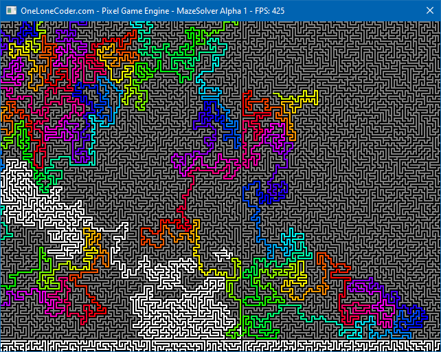

   MAZE DEMO
================


First, Acknowledgments
----------------------

Code used:
* CityHash by Geoff Pike and Jyrki Alakuijala from Google
* PCG by Melissa O'Neill
* PixelGameEngine by David Barr


Second, BackStory
-----------------

After working on my BackRooms inspired demo, I realized that the BackRooms constitute one of the largest mazes made by a computer (that isn't infinite). At a trillion passages by a trillion passages, it is larger than Daedalus' "World's Largest Maze" (https://www.astrolog.org/labyrnth/daedalus.htm). The only problem is: the BackRooms demo isn't a maze. It doesn't have one solution, it has infinite solutions, because it wasn't designed as a maze. It was designed to make labyrinthine corridors to creep out a player. So, I decided to make a program with a 2D maze. And that's the "Giant" maze.

The other largest maze on the Internet (that I've found) is here: https://www.gigapan.com/gigapans/171239. At 250000 by 250000 passages, it is one of the largest pictures I've ever seen, too. I took some advice from the creator of that picture (https://github.com/devedse/DeveMazeGenerator), and I probably could generate something that large with the code I have here, but as a monochrome bitmap and without a solution.

The design of the maze generating system was conceived around making the zones 65536 by 65536 and having 64 bit zone numbers, which gives a maze of one septillion by one septillion passages. I think it would be trivial to change the code to do that, but would it eat up memory. Each zone would take up sixty-four gigabytes of RAM in screen-display form.

The "Giant" maze is a proper maze, but it is not that interesting. It has the overall structure as follows:
```
+-+-+-+-+-+-+-+-+-+-+
|                   |
+-+-+-+-+-+-+ +-+-+-+
|                   |
+-+ +-+-+-+-+-+-+-+-+
|                   |
+-+-+-+-+-+-+-+-+ +-+
|                   |
+ +-+-+-+-+-+-+-+-+-+
|                   |
+-+-+-+-+-+-+-+-+-+-+
```
It is always solvable, and provably solvable. But it's not interesting. It is a nested-cell maze, in that each tile of the meta-maze is in-and-of-itself a maze. It's not fractal, though, because the meta-maze is of a fundamentally different type as the inner maze. But, realizing that I could make a nested-cell FRACTAL maze is what made me think of the Infinite maze. And that type of maze has memory that increases linearly as the maze size increases exponentially.

Note: nested cell and fractal are the terms the Daedalus author uses (and I expect he's an expert). I reinvented them from more-or-less first principles and then went back and learned the proper names.


Giant
-----



This simple program solves the trillion-by-trillion maze. After generating the maze with a recursive backtracker, it solves the maze using an A* implementation with a Manhattan metric. The demo will then play through the solution as fast as possible, leaving a rainbow-colored trail. The grey cells are those that the path finding algorithm put on the frontier while solving the maze. I actually did this to see cyan in the solution better, but it looks cool.

At 800 FPS, it will take about 2000 years to run to the first time the maze turns downward. But that's actually a long distance to go. It should normally only spend a thousand years on a level, and so should take four trillion years to solve. That's only, what, about 300 times longer than the time since the Big Bang. Black holes will still exist!


Infinite
--------

Currently, this is in work. Right now, it should run for around four weeks or so before crashing (if I did my math right THIS time).

Three things solved so far, I think:
* How do you solve an infinite maze without having all of the maze? Assuming that we are starting in the top-most, left-most corner: as we go out the layers of meta-maze in the fractal, we will eventually hit a layer where the only direction that we can go is either right or down. Which is to say that going the other direction provably cannot reach the bottom or right edges. Frequently, this is only one more layer. As soon as we can prove the direction we need to go, we don't need to generate any more layers, and can solve all intervening layers, and start working on the solution.
* How do you generate a seed for an infinite maze? Treat the position in the maze as a massive number, and then truncate the leading (or trailing) zeros. And then use the depth in the seed computation to make sure similar locations get different seeds.
* How do you know when a zone should connect to the next zone over? There is always a finite number of meta-mazes down to look until you are no longer at an edge, and can recurse back up.
